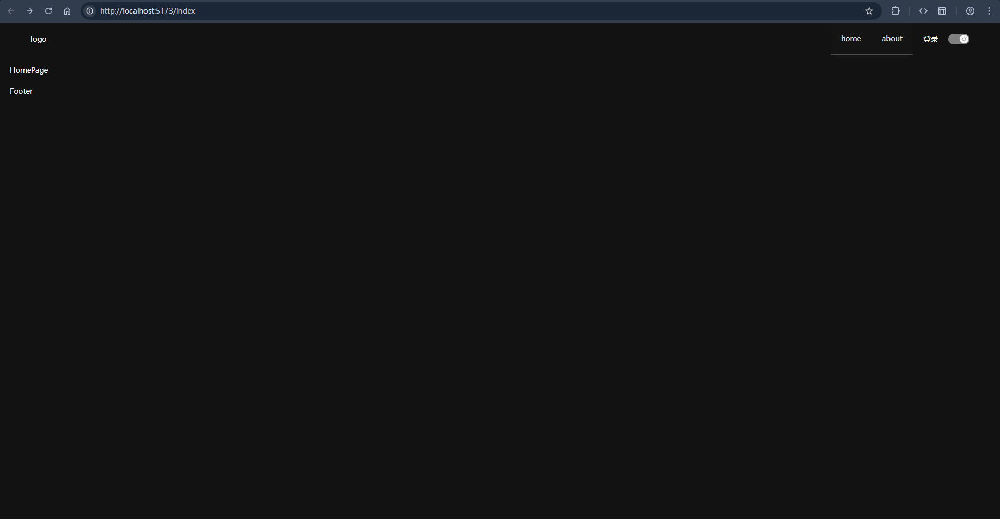
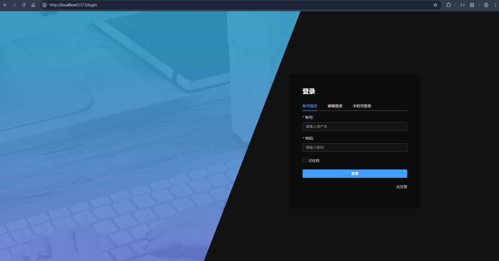

# fpt-cli

这是一个快速创建项目的cli工具,项目模板中包含了常用的项目配置,减少重复配置的时间,从而专注于项目的业务逻辑开发.
同时,使用了github actions,实现了项目的自动构建和部署.

目前提供的项目模板有:

- vue3 + ts
    - 包管理工具 pnpm
    - 构建工具 vite
    - 路由 vue-router
    - 状态管理 pinia
    - 网络请求 axios
    - 组件库 element-plus

- springboot3.5 + java21
    - 构建工具 maven
    - 数据库 mysql + mybatis-plus
    - 缓存 hutool-cache
    - 发布订阅 ApplicationEventPublisher

---

# 使用方法

1. 安装 cli 工具

```bash
npm install -g @qingjingyue/fpt-cli
```

2. 准备好项目目录

```
建议目录结构为:

projectName/
├── .github              # github actions
├── projectName-web      # 网页端
├── projectName-server   # 服务端
```

3. 创建项目

```bash
# 创建项目的 网页端,服务端,登录方式为 用户名密码登录,不使用 GitHub Actions 自动部署项目
fpt create --default
```
或

```bash
fpt create

? 请选择要创建的端: (↑/↓ 切换, 空格选择, a 全选, 回车确认)
❯◉ 网页端
 ◯ 服务端
 
? 请选择登录方式: (↑/↓ 切换, 空格选择, a 全选, 回车确认)
❯◉ 用户名密码登录
 ◯ 手机号登录
 ◯ 邮箱登录

? 是否使用 GitHub Actions 自动部署项目？ (y/N)
```

4. 初始化git仓库 (可选)

```bash
git init
```

5. 推送项目到github (可选)

```bash
git add .
git commit -m "init"
git remote add origin <你的远程仓库地址>
git push -u origin main
```

6. 配置github仓库的secrets (用于自动部署到服务器) (可选)

```
仓库Settings -> Secrets and variables -> Actions -> New repository secret

SERVER_IP=服务器IP
SERVER_PORT=22
SERVER_USER=服务器用户名
SERVER_PASSWORD=服务器密码
```

7. 前往阿里云申请AccessKey, 并配置到服务器的环境变量中 (用于发送手机号验证码) (可选)

```bash
# ~/.profile
# 设置阿里云AccessKey
export ALIBABA_CLOUD_ACCESS_KEY_ID=你的AccessKeyID
export ALIBABA_CLOUD_ACCESS_KEY_SECRET=你的AccessKeySecret
# 验证是否配置成功
echo $ALIBABA_CLOUD_ACCESS_KEY_ID
echo $ALIBABA_CLOUD_ACCESS_KEY_SECRET
```

8. 准备一个邮箱 (用于发送邮箱验证码) (可选)

```bash
# ~/.profile
export MAIL_HOST=你的邮箱服务器
export MAIL_USERNAME=你的邮箱
export MAIL_PASSWORD=你的邮箱授权码
# 验证是否配置成功
echo $MAIL_HOST
echo $MAIL_USERNAME
echo $MAIL_PASSWORD
```

9. 业务逻辑开发..., git提交代码到github仓库, 触发github actions, 自动构建和部署到服务器.  


---

# 项目配置

## vue 模板

### 目录结构

```
   vue/
    ├── .vscode             # vscode 配置文件, 包含了常用的插件和设置
    ├── conf.d              # nginx 配置文件, 包含了项目的 nginx 配置
    ├── env/                 # 环境变量配置文件目录
    │   ├── .env.dev                # 开发环境配置文件
    │   ├── .env.prod               # 生产环境配置文件
    │   ├── env.d.ts                # 环境变量类型定义文件
    ├── public              # 包含favicon.ico
    ├── src/                # 项目源代码目录
    │   ├── apis                # 后端接口
    │   ├── assets              # 静态资源
    │   ├── components          # 组件
    │   ├── composables         # 组合式函数
    │   ├── router              # 路由配置
    │   ├── store               # 状态管理
    │   ├── types               # 类型定义
    │   ├── utils               # 工具函数
    │   ├── views               # 视图组件
    │   ├── App.vue
    │   ├── main.ts
    ├── docker-compose.yml      # 用于 docker 部署, 搭配conf.d
    ├── eslint.config.ts        # eslint 配置文件
    ├── index.html
    ├── package.json
    ├── pnpm-lock.yaml
    ├── tsconfig.json
    ├── vite.config.ts
```

---

### 功能实现



- light - dark 主题切换
- 实现菜单切换,可根据具体内容填充页面


- 登录页面图片可切换,登录方式可选
- 用户名密码登录注册
- 手机号验证码登录注册
- 邮箱验证码登录注册
---

## springboot 模板

### 目录结构

```
springboot/
    ├── common                  # 公共模块, 包含了常用的类, 常量, 枚举, 异常, 拦截器, 工具类, 配置类, 自动配置等
    ├── domain                  # 领域模型模块, 包含了项目的实体类, dto, po, vo等
    ├── server                  # 服务模块, 包含了项目的controller, service, mapper, mq.listener等
    │   ├── src/main/resources/
    │                   ├── application.yml          # 公共配置文件
    │                   ├── application-dev.yml      # 开发环境配置文件
    │                   ├── application-prod.yml     # 生产环境配置文件
    ├── sql                     # 数据库目录, 用于初始化数据库
    ├── docker-compose.yml      # 用于 docker 部署, 搭配sql
    ├── pom.xml                 # 包含了项目的依赖和配置

```

### 功能实现

- 用户名密码登录注册
- 手机号验证码登录注册
- 邮箱验证码登录注册
- JWT 认证
- 全局异常处理
- 统一响应体Result
- Knife4j 接口文档

---